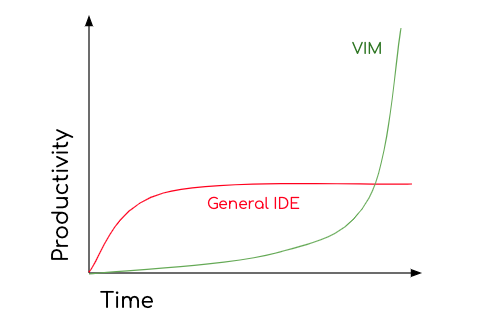

# my tools

## nvim
### intro
neovim is a community fork of vim. it's great! 

i would you like to direct your attention to the following diagram:  


i would recommend starting out with the vscode vim or neovim plugins for vscode,
so that you don't just fully jump off into the deep end all at once. that's what
i did.

### install
to install neovim, i find it's simplest to install it from source. the pinned
version of neovim in the ubuntu package registry is pretty old, especially on
OS's such as *cough* *cough* Ubuntu 22.04.

neovim has great build instructions. you can find them [here](https://github.com/neovim/neovim/blob/master/BUILD.md)!

this is great, because when neovim releases a new stable version, you can update
by running ```git pull``` inside the neovim repo, and then rebuilding and
reinstalling.

### package managers
i watched [this video](https://www.youtube.com/watch?v=w7i4amO_zaE) to learn how to configure neovim
it's pretty outdated now. the package manager he uses, "packer", is abandoned.

a very popular package manager and the one i use now is [lazy.nivm](https://github.com/folke/lazy.nvim)

in neovim, the package manager installs and manages your plugins. these are
exactly like vscode plugins. most plugins live on github, and you can install
anything you want. you can even [write your own](https://www.youtube.com/watch?v=VGid4aN25iI&list=PL8M9ZjrDX7lp_Cfr5cul2pLZm-vle9Sns).

you can checkout my neovim config for ideas on how to structure your own:
https://github.com/gjcliff/nvim

in fact, after you install neovim, you could clone into the ```~/.config/``` dir
and use my config straight up.

### plugins
there are a huge amount of plugins, here are some ones i like

#### colorschemes
- [brightburn](https://github.com/erikbackman/brightburn.vim)
- [kanagawa](https://github.com/rebelot/kanagawa.nvim)
- [nightfox](https://github.com/EdenEast/nightfox.nvim)
- [gruvbox](https://github.com/ellisonleao/gruvbox.nvim)
- [rose-pine](https://github.com/rose-pine/neovim)

#### lsp
watch this (required):
https://www.youtube.com/watch?v=bTWWFQZqzyI

this is kinda hard to figure out. you can checkout my lsp.lua file in my config asan
an example. i use something called [Mason] to install lsps easily.

### learning
it takes time to learn vim

here's a playlist with some great videos on youtube for learning vim motions.
https://www.youtube.com/watch?v=X6AR2RMB5tE&list=PLm323Lc7iSW_wuxqmKx_xxNtJC_hJbQ7R

vim be good
https://github.com/ThePrimeagen/vim-be-good

you can just hop right into vim-be-good with this docker command:
```bash
docker run -it --rm brandoncc/vim-be-good:stable
```

# alacritty
alacritty is a terminal emulator that uses gpu acceleration and can be
configured with a simple toml file. other terminals you may be interested in
include:
- [ghostyy](https://ghostty.org/)
- [kitty](https://sw.kovidgoyal.net/kitty/)
- [wezterm](https://wezterm.org/index.html)

my alacritty config can be found at:
https://github.com/gjcliff/.dotfiles/blob/main/.config/alacritty/alacritty.toml

install a nerd font so that things work right. this is the one i use:
```bash
/bin/bash -c "$(curl -fsSL https://raw.githubusercontent.com/JetBrains/JetBrainsMono/master/install_manual.sh)"
```

there are other fonts:
- [Hack](https://github.com/source-foundry/Hack)
- [FiraCode](https://github.com/tonsky/FiraCode)
- many many many other fonts

# tmux
install with
```bash
sudo apt install tmux
```

you can configure tmux with a file. tmux looks for its config at these locations
in order:
- $TMUX_CONF (set in ```~/.bashrc```)
- ```~/.tmux.conf```
- ```$XDG_CONFIG_HOME/tmux/tmux.conf``` (usually ```~/.config/tmux/tmux.conf```)
- /etc/tmux.conf (system wide)

i use the second method. you can take a look at my tmux config file [here](https://github.com/gjcliff/.dotfiles/blob/main/.tmux.conf)

here are some things i think you should definitely have in your config:
```sh
# allows you to reload your config with ctrl+r, instead of having to quit tmux
# to see the changes you make
unbind r
bind r source-file ~/.tmux.conf \; display-message "Config reloaded..."

# change default prefix to ctrl+s from ctrl+b
set -g prefix C-s

# mouse support
set -g mouse on

# change vertical and horizontal split to ctrl+s+v and ctrl+s+s, respectively.
# as opposed to the defaults of % and " (gross)
bind-key v split-window -h
bind-key s split-window -v

# use ctrl+y to full screen your active tmux pane, hit it again to unfullscreen
unbind-key z
bind-key y resize-pane -Z

# color settings for nvim
set -g default-terminal "tmux-256color"
set-option -a terminal-overrides 'alacritty:Tc'

# tpm: https://github.com/tmux-plugins/tpm
# follow the instructions in the installation section.
# you'll need this:
set -g @plugin 'tmux-plugins/tpm'
set -g @plugin 'tmux-plugins/tmux-sensible'

# install the dracula plugin for pretty colors in the status bar at the top
# https://github.com/dracula/tmux
set -g @plugin 'dracula/tmux'
set -g @dracula-show-powerline true
set -g @dracula-fixed-location "Washington D.C."
set -g @dracula-show-flags true
set -g @dracula-show-left-icon "#h | #S"
set -g @dracula-battery-label false
set -g @dracula-show-battery-status true
set -g @dracula-network-hosts "1.1.1.1 8.8.8.8"
set -g @dracula-network-ethernet-label "󰌗 Eth"
set -g @dracula-network-offline-label "󱍢 "
set -g @dracula-network-wifi-label ""
set -g @dracula-show-ssh-only-when-connected true
set -g @dracula-plugins "network ssh-session network-bandwidth cpu-usage ram-usage battery weather time"
set -g status-position top

run '~/.tmux/plugins/tpm/tpm'
```

the bottom of my config is related to integrating with a neovim plugin to allow
me to move between tmux terminals and nvim buffers with the same motion. [here's
the plugin](https://github.com/christoomey/vim-tmux-navigator). i need to explain this further.

the default prefix is ctrl+b in tmux. i changed mine to ctrl+s because i think
it's easier to hit. 

# zsh
# omz
# keybindings
# configs
# zshrc
# bashrc
